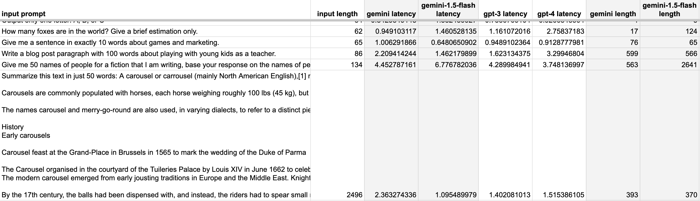

# Measuring and Solving Latency in Generative AI: A Complete Guide

## How to run

1. Clone this repository
2. `pip install -r requirements.txt`
3. Modify `data.json`  (optional)
4. Create `.env` and add your API keys for OpenAI and Google

```
GOOGLE_API_KEY=YOUR-KEY-HERE
OPENAI_API_KEY=YOUR-KEY-HERE
```


5. Then run the program with `python3 -m app.py`


### We will compare latencies between Gemini and GPTs, and propose solutions to decrease this time delay.


Latency, the time delay between a request and the
corresponding response, is a critical aspect of 
any technology, including the powerful Generative AI
models such as GPT and Gemini, when used via API.

In this blog post, we'll delve into the nuances of
latency in LLMs, exploring its implications for 
both engineers and users.

We will be investigating:

- How long is the latency for the GPT models and Gemini when using their respective APIs
- How much does te size of inputs and outputs change the response time
- How to reduce latency in such API calls

> This article is brought to you by 🐺 [Wolfflow AI](https://wolfflow-ai.beehiiv.com)


## 1. What is latency and why should we care

Latency refers to the delay between sending a message and receiving its response.

In simpler terms, when you message a friend, there's a brief wait before they reply.  In everyday situations, latency is the time it takes for your friend to read, type a response on their device, and hit send.

In computer terms, latency encompasses the duration it takes for your message to travel from your device to the server, the time for the server to process your request, and the journey back to your device.

Computers always experience latency because your message needs to travel from your device to the server and back. Despite the virtual nature, a physical signal is sent via the internet connection, whether through a cable or wirelessly.

This is why accessing a webpage from another continent generally takes longer compared to a national page.

Reducing latency to near-zero seconds ensures a seamless virtual experience, while prolonged delays lead to discomfort.

Understanding how to measure and minimize latency is crucial for practical applications because users genuinely care—I know you do.

Now, let's see it in details in the next section the tests for latency in Generative AI applications like ChatGPT and Google Gemini.

## 2. Preparing the test

While we won't directly test Google Gemini and ChatGPT, we'll be utilizing the underlying models through their APIs.

In Python, we'll send prompts to these models and measure the time it takes for them to provide responses. Our focus will be on testing three models: Gemini, GPT-3, and GPT-4.

We will be testing three models: Gemini, GPT-3 and GPT-4.

I've curated 12 prompts, ranging from concise requests to more extensive ones, instructing the models to respond with just a few words or exceeding 50 to 100 words. Here are a couple of sample prompts I've prepared:

> Output only one letter: A, B, or C

And 

> How many foxes are in the world? Give a brief estimation only.

And 

> Write a blog post paragraph with 100 words about playing with young kids as a teacher.

You can check all the prompts I prepared in a couple of sections below.

With the prompts ready and the models defined, we can now run the tests.

## 3. What we will measure

We are interested in the following metrics:

- The length of the input in number of characters
- The length of the output in number of characters
- The time it took in seconds

With these metrics we will be able to understand the following:

- **Average** (s): it provides a general sense of the typical time it takes for an API request to be processed. It's a key indicator of the overall efficiency of the system.
- **Median** (s): is resistant to outliers, providing a more representative measure of central tendency. It helps in understanding the typical user experience without being heavily influenced by extreme values.
- **Highest and Lowest** (s): Identifying the highest and lowest latency values helps in recognizing outliers or exceptional cases. This information is critical for understanding the range of possible outcomes.
- **Correlation** between input and output: Understanding the correlation between input characteristics (e.g., length) and latency, as well as output characteristics and latency, helps in recognizing patterns and dependencies. The correlation coefficients are between -1 and 1. A value closer to 1 indicates a strong positive correlation, a value closer to -1 indicates a strong negative correlation, and a value near 0 suggests a weak or no correlation. 

## 4. Test Results

Here is the result of the test



> 👉 [Click here](https://docs.google.com/spreadsheets/d/1dn7hzIam1i5zaSdt-FhWTH0-ZH6lmdFsEvNclidmkGY/edit?usp=sharing) to view the full sheet with the results and the repository with the code.

We can see that, for this particular test,
on average GPT-3 was faster than the other models.

> ℹ️ Keep in mind that various factors influence the latency of an API response. Elements such as Server Load, Network Latency, and Endpoint Processing Time play significant roles. For a comprehensive breakdown of these points, I suggest asking ChatGPT: `Give a list of things that can impact the latency time of an API request`

In addition, there is a high correlation
between the length of the output and the latency time, which means
that the shortest the output, the fastest you will get the answer from the model.

## 5. Insights from the test

Now that we got the results, we want to better understand it to make us able to make better
decisions regarding building Generative AI applications.

### Average

The average time of the latency in both Gemini and GPT models were around 3 and 4 seconds, respectively. 
Which means that on average, users will have to wait for around 3 to 4 seconds when prompting these models.

### Highest 

The highest latency we 9.46 seconds for GPT-4. If the latency takes 10 seconds or longer, one approach
to improve the user experience might be to downgrade the version to GPT-3, which had the lowest highest
latency of 4.28 seconds, beating Gemini Flash.

### Lowest

In theory, we want the lowest latency to be as close to 0 seconds as possible. But since it is not possible,
we need to consider which requests result in the lowest latencies, and capitalize on those
to make our application as seamless as possible. In the case of our test, the lowest latency
was 0.47 for GPT-4. 

### Correlation

We can see that the correlation shows that the longer the answer from the bot, the more time
the user has to wait. The opposite also holds true: the shorter the answer, the fastest
the response is. We can use this information to better craft prompts that focus on providing
shorter answers to reduce the response delay.


## 6. How to Reduce Latency

So far in this article we covered:
- How long it takes for a request to be completed in Gemini and GPTs (3.5 and 4).
- Which metrics to use and how to get impactful insights from the results

Now we will have a deeper look on what to do with that information, in a practical way.

As mentioned previously, we want to reduce the latency to as close to 0 seconds as possible. Let's 
see if and how we can do that.

Here are three ways we can use to reduce latency:

### Caching and Preemptive Caching

We can do  the same thing to reduce the latency between requests: instead of waiting 
for the model to answer the user's query, we can simply fetch it from our database, assuming
we already stored the answer for the same query.

I've covered a similar approach to use cache to reduce the cost of running
the GPT models in [this article](https://medium.com/@paulo_marcos/how-to-reduce-the-cost-of-running-the-gpt-models-04f6d5a6edde#:~:text=3.%20Reducing%20cost%20by%20caching%20the%20prompts).


A step-by-step guide on how to do it is as follows:

```text
1. Receive user query
2. Check if the same query has been received and answered before
  2.1 If it has, fetch from the database and return the retrieved answer. Go back to step 1.
  2.2 If it is a brand new query, go to step 3
3. Pass the query to the Generative AI model (Gemini, GPT, etc)
4. Get the answer from the model
5. Store the answer with the query in the database
6. Return the answer from the model to the user
```

Before applying cache, we would have an average of 3.5 seconds for short-answer queries.

With cache, this would drop to less than 0.5 seconds, even for long-answer queries, reducing
the wait time by up to 90%.

This is built over time as the users send queries to your application.

We can shortcut this process by using a preemptive caching strategy:

- Before any users send requests to your application, you can generate a database ahead of time manually by using Generative AI tools such as ChatGPT. More on that [here](https://medium.com/@paulo_marcos/how-to-reduce-the-cost-of-running-the-gpt-models-04f6d5a6edde#:~:text=4.%20Generate%20cache%20ahead%20of%20time).


### Limit Response Size

As we've seen earlier, the longer the answer from the model, the longer it takes for it to respond.

So, we can limit the size in which the generative AI will answer to reduce the latency.

There are two ways we can achieve this:

1. Add specific instructions for the model in our system prompt to limit the size of the output
2. Use hard-coded `max_tokens` parameter in our application. That will make sure the model doesn't answer with anything longer than that limit.

**For number 1**, here are a couple of examples on how we can instruct the model to limit the size via prompt:

> Do [insert task here]. Make sure your answer fits in less than [insert number here] words.

Or

> Do [insert task here]. Give your answer in exactly [insert number here] sentences.

**For number 2**, here is one example in a Python code on how to set the `max_tokens` limit:

```python
from dotenv import load_dotenv
import openai

# Your OpenAI API key
load_dotenv()
client = openai.OpenAI()
response = client.chat.completions.create(
            model="gpt-3-turbo",
            messages=[
                {"role": "system", "content": "You are a nice assistant."},
                {"role": "user", "content": "Write a nice blog post on how to write articles."}
            ],
            max_tokens=300
        )
```
Check above that we have passed the `max_tokens` as 300.

To know what is a token and how to count them in your prompts, check [it here](https://medium.com/@paulo_marcos/how-to-reduce-the-cost-of-running-the-gpt-models-04f6d5a6edde#:~:text=1.1%20Understanding%20Tokens).

### Psychological Latency Reduction

This is one of the most powerful ways of shortening latency in any program: by making the user
feel that the response time is faster than it actually is.

Shortening latency is not a trivial task, and more often than not there is not much
we can do: the latency depends on how many requests are currently being processed in the server,
your internet connection, server resources, and many other things out of our control.

What we can control, however, is the user experience.

Imagine: you ask ChatGPT a question, and nothing happens.

...

10 seconds later your answer appears.

Not very good, right?

On the other hand, imagine you ask ChatGPT the same question.

Then right away parts of the answer start appearing on the screen, one after the other,
in order. 

It takes the same 10 seconds for it to finish.

You didn't feel the same "emptiness" as before, right? Yes, psychology.

In programming terms, you can achieve this with **streaming**. Here is the official documentation on how to use it, for:

- [GPT](https://platform.openai.com/docs/api-reference/chat/create#chat-create-stream) 
- [Gemini](https://cloud.google.com/vertex-ai/docs/generative-ai/learn/streaming)

**What if I can't use streaming?**

Then we have a couple of alternatives:

1. Signal that the model is processing the request by visually adding a loading icon to your user interface
2. Signal that the model is processing by replying to the user before you get the final answer

**For number 2**, let's imagine, again, the following:

You ask ChatGPT a question. 

It answers first: "I see, let me think..." 2 seconds after your message.

Then, after 8 seconds, you get the answer you were looking for.

Better than getting nothing for the whole 10 seconds you were waiting, right?

All ChatGPT did in this example was to acknowledge that it fully got your message,
and on top of that it signals to you that it is coming up with an answer.

Users feel way less anxious, and all we did was to ensure that it replied with a single message. Cool.

This can help immensely improving the user experience in your applications, I've 
applied this technique in the past with great success. I am sure you can too.

## Conclusion

in this article we covered:
- How long it takes for a request to be completed in Gemini and GPTs (3.5 and 4).
- Which metrics to use and how to get impactful insights from the results
- Three ways to reduce latency: cache, response size limit, psychological latency reduction.

Now I believe we are better prepared to build LLM applications that provide our customers with a better
user experience.

If you enjoyed this article, you will definitely enjoy the newsletter: on top of
these articles, I compile tutorials, tips and use-cases to further improve
productivity and reduce costs with AI. Available on the link below:

> 👉 [Learn the best ways to use AI to reduce costs and increase productivity straight to your inbox, for free](https://wolfflow-ai.beehiiv.com/subscribe)

Thank you very much for reading this whole article,
and I see you next time.